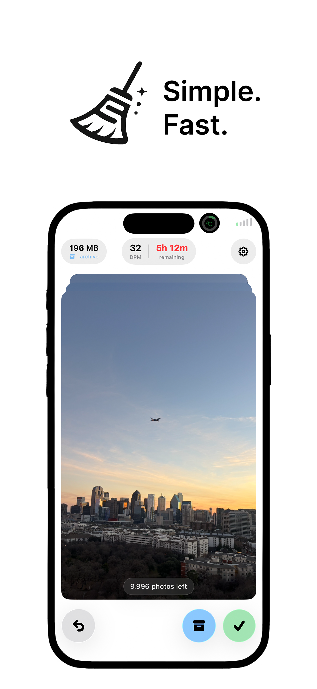
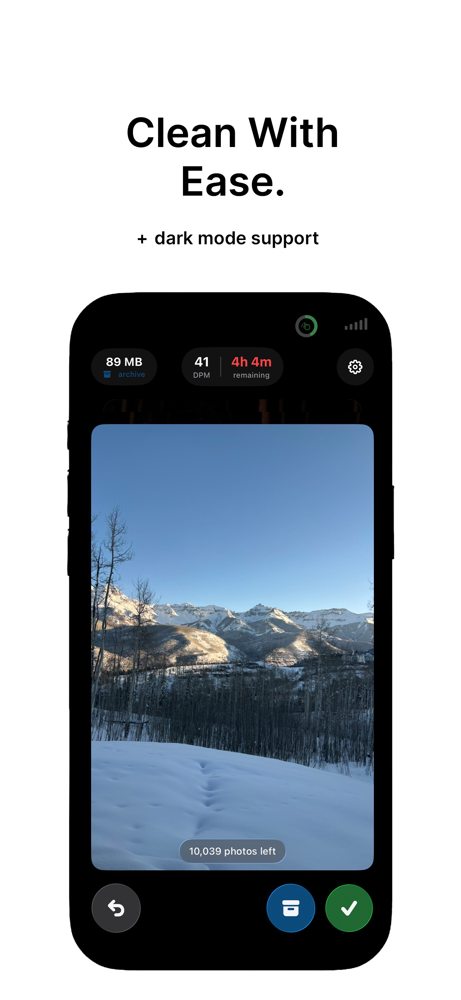
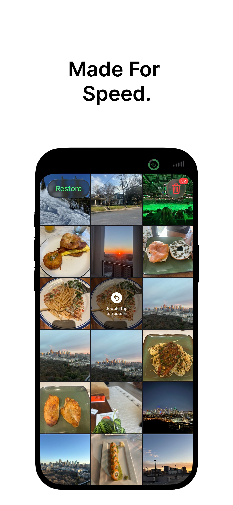
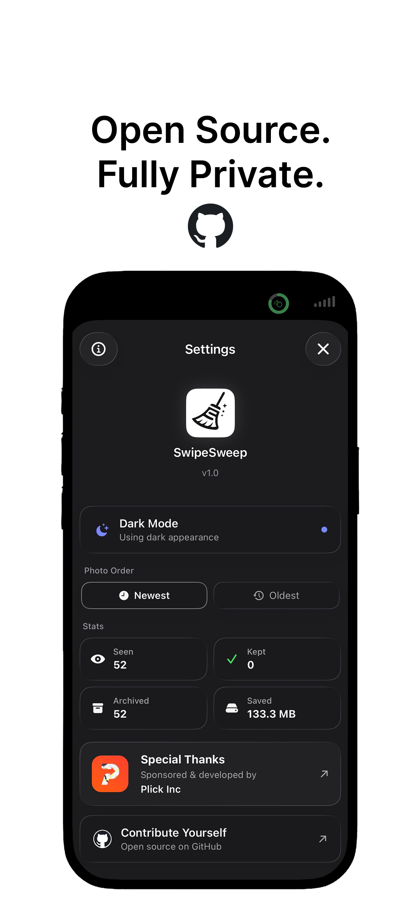

# SwipeSweep 🧹

> A fully native, open source iOS photo cleaner — built in 24 hours because everything else looks like garbage and im not paying $9.99 a month...

<div align="center">

| | | | |
|:---:|:---:|:---:|:---:|
|  |  |  |  |

</div>

---

## Why

Every photo cleaner on the App Store is bloated, paywalled, or just plain ugly. I wanted one that was:

- **Fully open source** — no black boxes
- **Fully native** — SwiftUI, no cross-platform compromises
- **Lightweight** — 556 KB binary
- **Actually fun to use** — swipe to keep, swipe to archive, done

## The Challenge

Built end-to-end in **24 hours**. That meant making smart tradeoffs fast.

### How I kept the binary under 600 KB

All images are offloaded to a **Cloudflare CDN** instead of bundled into the app. The app itself contains zero image assets beyond the icon — everything is fetched on demand. Result: a 556 KB `.ipa` that installs in seconds.

### Distribution

Automated with **Fastlane** — one command builds, signs, and ships to App Store Connect:

```bash
fastlane release
```

### Privacy by design

- No accounts
- No analytics
- No third-party SDKs
- State persists across app restarts using Apple's native frameworks — no cloud sync, no servers
- Photos never leave your device

## How it works

Swipe left to archive a photo to Recently Deleted. Swipe right to keep it. Tap undo to reverse. That's it.

Your progress (photos seen, archived, saved MB) is tracked locally and persists across sessions. Everything is handled within the app — no outside extensions, no external dependencies.

## Stack

- **SwiftUI** — UI
- **PhotoKit** — photo library access
- **UserDefaults / AppStorage** — local state persistence
- **Fastlane** — automated App Store distribution
- **Cloudflare CDN** — image hosting (keeps binary tiny)

## Pages

- [Privacy Policy](https://graygillman.github.io/SwipeSweep/privacy.html)
- [Support](https://graygillman.github.io/SwipeSweep/support.html)

## Project structure

```
SwipeSweep/
├── App.swift
├── View/
│   ├── PhotoSwipeView.swift
│   ├── PhotoCardView.swift
│   ├── DeletedPhotosView.swift
│   ├── SettingsView.swift
│   └── ...
├── ViewModel/
│   ├── PhotoSwipeViewModel.swift
│   └── DeletedPhotosViewModel.swift
├── Managers/
│   └── PhotoStateManager.swift
└── Model/
    ├── SwipePhoto.swift
    └── PhotoState.swift
```

## Contributing

Open to PRs. If you find something broken or have an idea, open an issue.

## License

MIT